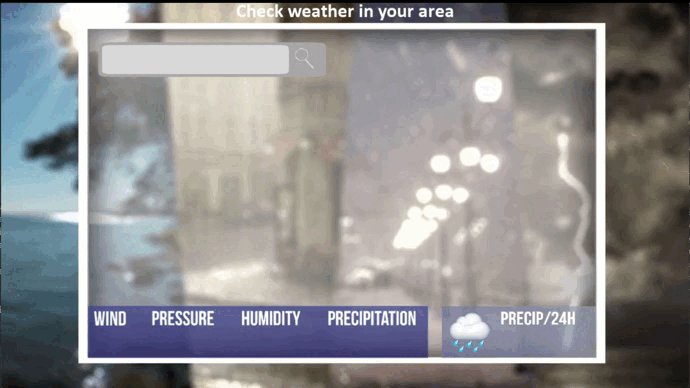
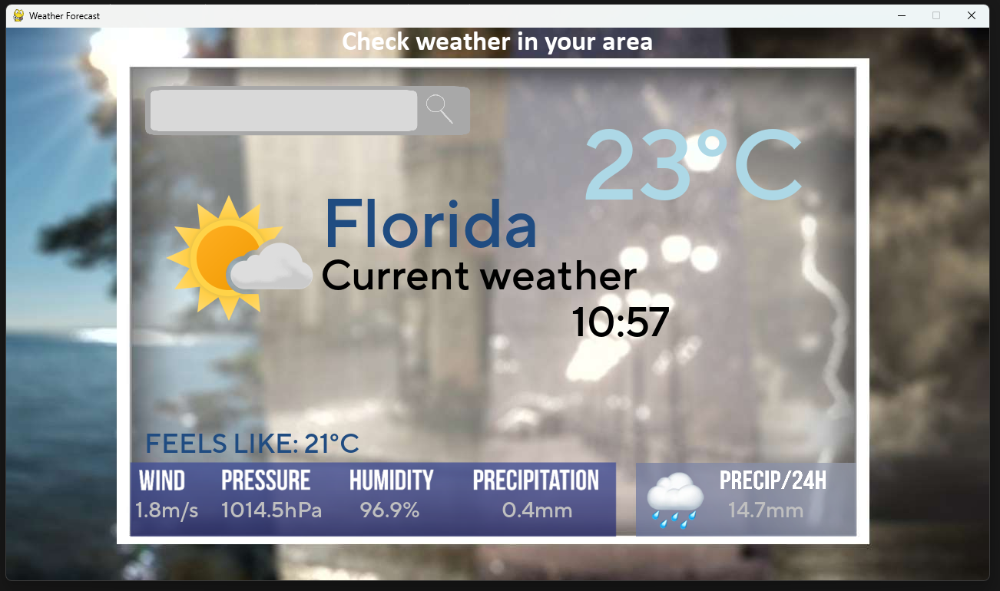

# Weather Forecast
* Weather Forecast application made using Pygame and various API's, used to display weather consing for a specific location




## 💪 Features
 
- Ability to find weather information, based on the specific city
- Wind speed
- Pressure
- Humidity
- Precipitaion amount / h
- Precipitation amount / 24h
## 🏗️ Built With

* [](https://www.python.org/downloads/)
*  [](https://www.pygame.org/download.shtml)
* [](https://api.met.no/)

<a id="prerequisites"></a>
## 📖 Prerequisites 
You need to have [Python 3.9](https://www.python.org/downloads/release/python-390/) installed. However the application could still work with older version installed

Modules needed:
```
pygame 2.5.1
```
```
requests 2.31.0
```
```
metno-locationforecast 1.1.0
```
```
timezonefinder 6.2.0
```
```
pytz 023.3
```

3. Compile all the files using Visual Studio or the IDE of your choice

## ✨ Contributing

If you have a suggestion that would make this better, please fork the repo and create a pull request. You can also simply open an issue.
Don't forget to give the project a star! Thanks!

1. Fork the Project
2. Create your Feature Branch (`git checkout -b feature/AmazingFeature`)
3. Commit your Changes (`git commit -m 'Add some AmazingFeature'`)
4. Push to the Branch (`git push origin feature/AmazingFeature`)
5. Open a Pull Request

## 👨‍💻 Getting Started    
1. Clone the repository
    ```
    git clone https://github.com/SteponasK/Weather-Forecast
    ```
2. Download and import all  the required modules. List of the modules can be found in [Presequites](#prerequisites) section or [requirement.txt](requirements.txt) file

## 👑 Authors

* **SteponasK** - *Initial work* 

## 📜 License

This project is licensed under the GNU GENERAL PUBLIC LICENSE - see the [LICENSE](LICENSE) file for details

## Notes on licensing
 * [metno-locationforecast](https://github.com/Rory-Sullivan/metno-locationforecast) is a Python interface for the MET Norway Locationforecast/2.0 service. [Author's](https://github.com/Rory-Sullivan) page.
* MET Weather API Terms of Service - https://api.met.no/doc/TermsOfService

